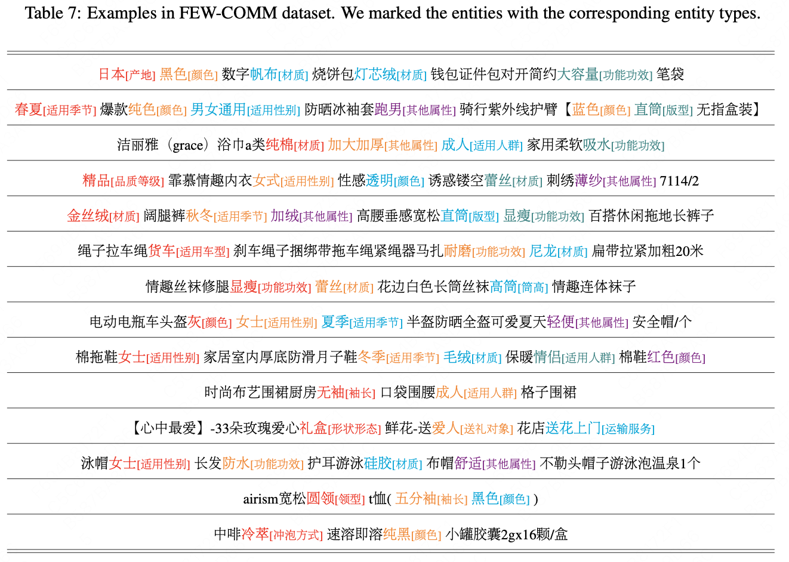

# Meta-Learning Triplet Network with Adaptive Margins for Few-Shot Named Entity Recognition

This repository contains the code and data for our paper:

[*Meta-Learning Triplet Network with Adaptive Margins for Few-Shot Named Entity Recognition*](https://arxiv.org/pdf/2302.07739)

If you find this work useful and use it on your own research, please cite our paper.

`````
@article{han2023meta,
  title={Meta-Learning Triplet Network with Adaptive Margins for Few-Shot Named Entity Recognition},
  author={Chengcheng Han and 
          Renyu Zhu and 
          Jun Kuang and 
          FengJiao Chen and
          Xiang Li and
          Ming Gao and
          Xuezhi Cao and
          Wei Wu},
  journal={arXiv preprint arXiv:2302.07739},
  year={2023}
}
`````

### Overview

We propose an improved triplet network with adaptive margins (MeTNet) and a new inference procedure for few-shot NER.

We release the first Chinese few-shot NER dataset FEW-COMM.

### Data

The datasets used by our experiments are in the `data/` folder, including FEW-COMM, FEW-NERD, WNUT17, Restaurant and Multiwoz.

<!-- We ran experiments on a total of 4 datasets. You may unzip our processed data file `data.zip` and put the data files under `data/` folder. -->

<!-- | Dataset | Notes |
|---|---|
|  -->

**FEW-COMM** is a Chinese few-shot NER dataset we released, which consists of 66,165 product description texts that merchants display on a large e-commerce platform, including 140,936 entities and 92 pre-defined entity types. These entity types are various commodity attributes that are manually defined by domain experts, such as "material", "color" and "origin". Please see Appendix C of our paper for more details on the dataset.


<!-- | FewNERD ([link](https://ningding97.github.io/fewnerd/)) | Processed data available. |
| WNUT17 ([link](https://aclanthology.org/W17-4418.pdf)) | We used a subset of the product review data. Processed data available. |
| Restaurant ([link](http://people.csail.mit.edu/jrg/2013/liu-icassp13.pdf)) | Processed data available. | 
| Multiwoz ([link](https://arxiv.org/pdf/1810.00278)) | Processed data available. |  -->


## Setup

This implemetation is based on Python3.7. To run the code, you need the following dependencies:

- nltk>=3.6.4
- numpy==1.21.0
- pandas==1.3.5
- torch==1.7.1
- transformers==4.0.1
- apex==0.9.10dev
- scikit_learn==0.24.1
- seqeval

You can simply run

```Sh
pip install -r requirements.txt
```

## Repository structure

We select some important files for detailed description.

```Shell
|-- data # experiments for five datasets
    |-- Few-COMM/ # a Chinese few-shot NER dataset we released
|-- model # includes all model implementations
|-- transformer_model # includes BERT pre-trained checkpoints
	|--bert-base-chinese
	|--bert-base-uncased
|-- utils
    |-- config.py # configuration
    |-- data_loader.py # load data
    |-- fewshotsampler.py # construst meta-tasks
    |-- framework.py # includes train\eval\test procedure
    |-- tripletloss.py # an improved triplet loss
|-- main.py
|-- run.sh
```

### Quickstart

1. Unzip our processed data file `data.zip` and put the data files under `data/` folder.

2. Please download pretrained BERT files [bert-base-chinese](https://huggingface.co/bert-base-chinese/tree/main) and [bert-base-uncased](https://huggingface.co/bert-base-uncased/tree/main) and put them under `transformer_model/` folder.

3. ```sh run.sh```

   You can also adjust the model by modifying the parameters in the `run.sh` file.

Currently, the benchmarks on the FEW-COMM dataset are as follows:

| FEW-COMM | 5-way 1-shot | 5-way 5-shot | 10-way 1-shot | 10-way 5-shot |
| ---| ---| ---| ---| ---|
|MAML|28.16|54.38|26.23|44.66|
|NNShot|48.40|71.55|41.75|67.91|
|StructShot|48.61|70.62|47.77|65.09|
|PROTO|22.73|53.95|22.17|45.81|
|CONTaiNER|57.13|63.38|51.87|60.98|
|ESD|65.37|73.29|58.32|70.93|
|DecomMETA|68.01|72.89|62.13|72.14|
|SpanProto|70.97|76.59|63.94|74.67|
|**MeTNet**|**71.89**|**78.14**|**65.11**|**77.58**|

If you have the latest experimental results on the FEW-COMM dataset, please contact us to update the benchmark.

For the [FewNERD](https://github.com/thunlp/Few-NERD) dataset, please download it from its official website.

<!-- After you have finished configuring the `data/` folder and the `pretrain_wordvec/` folder, you can run our model with the following commands. 
```
cd bin
sh mlada.sh
```
You can also adjust the model by modifying the parameters in the `malada.sh` file. -->

<!-- ### Dependencies
- Python 3.8
- nltk>=3.6.4
- numpy==1.21.0
- pandas==1.3.5
- torch==1.7.1
- transformers==4.0.1
- apex==0.9.10dev
- scikit_learn==0.24.1
- seqeval -->
<!-- - Python 3.7
- PyTorch 1.6.0
- numpy 1.18.5
- torchtext 0.7.0
- termcolor 1.1.0
- tqdm 4.46.0
- CUDA 10.2 -->

## Attribution

Parts of this code are based on the following repositories:

- [FewNERD](https://github.com/thunlp/Few-NERD)
- [MLADA](https://github.com/hccngu/MLADA)

